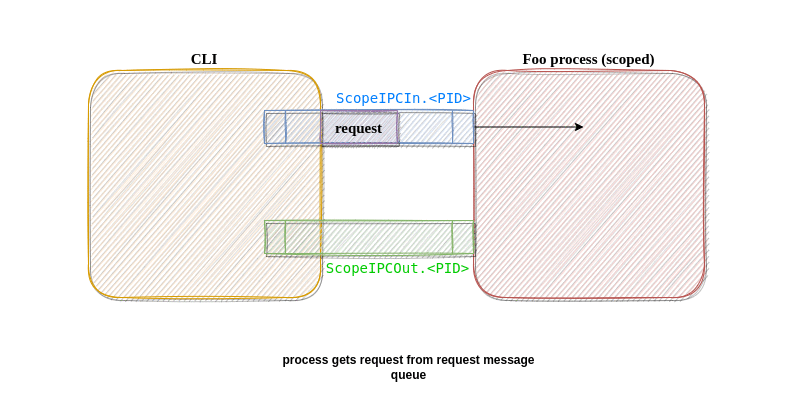

# IPC Notes

- For IPC communication we are using pair of posix message queue:

- The client in the communication is `scope`
- The server in the communication is scoped application
- The message queue created by `scope` is `ScopeIPCOut.<PID>` and `ScopeIPCIn.<PID>`
- scoped application reads from `ScopeIPCIn.<PID>` and writes to `ScopeIPCOut.<PID>`
- `scope` reads from `ScopeIPCOut.<PID>` and writes to `ScopeIPCIn.<PID>`
- The message queues are used in non-blocking way - both by client and server

# Protocol

Initial approach for the protocol between cli and library for IPC communicaiton was based on JSON format.
Unfortunately we cannot use it directly since message queue size restrictions.

Therefore we introduced framing mechanism into the protocol.

The default message takes following form:

Without framing mechanism:

<METADATA_JSON><NUL><SCOPE_JSON>

With framing mechanism:

<METADATA_JSON><NUL><PART_OF_SCOPE_JSON>

Example:
<TODO>

# IPC adding new request

Depending on expected logic adding new request required adding handling both on CLI side and library side.

- Adding new request, CLI: `ipcscope.go`
- Adding new request, library: `ipc_scope_req_t` in `ipc.c`
- Adding response for the request, CLI: `ipcscope.go`
- Adding response for the request, library: `*supportedResp` in `ipc.c`
- (Optional) Adding processing request in the library see `ipcProcessSetCfg` as an example
