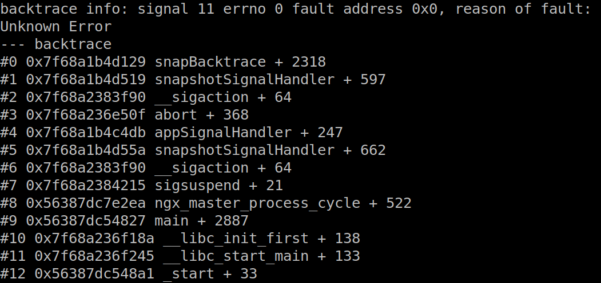

## Application Crash Analysis with AppScope

Here you will learn how to use AppScope and eBPF technology to:

- Generate useful files when an application crashes (backtrace, core dump, snapshot)
- Send those files to a network destination, before the environment is torn down

You will need:

- A Linux host
- Docker

For example’s sake we will:
- Use nginx as our crashing process
  - Any process is fine.
- Run nginx in a docker container
  - On the host would be fine too.
- Use Cribl Cloud as our network destination, and route our crash data to S3
  - Any network destination is fine… or just view the files on disk


### Preparation

Set up your Cribl Cloud instance:

_Tip: Sign up for a free account at [https://cribl.cloud](https://cribl.cloud)._

1. Click 'Manage Stream'
2. Click 'default' under 'Worker Groups'
3. Click 'Data -> Destinations' and choose the Amazon S3 source
4. Click 'Add Destination' and configure the destination with your S3 credentials and preferences. Click 'Save'
5. Click 'Data -> Sources' and choose the TCP source
6. Click 'in_tcp' and configure the source to be Enabled, with address 0.0.0.0 and port 10060.
7. Click 'Connected Destinations' and choose 'QuickConnect'. Select your S3 Destination. Click 'Save'
8. In the top right corner of the screen, click 'Commit and Deploy'

At this point, you have configured a Cribl Cloud worker to listen to TCP data and send it on to S3. Great!

Download the AppScope binary:
```
cd ~/Downloads  
curl -Lo scope https://cdn.cribl.io/dl/scope/1.4.1/linux/$(uname -m)/scope
curl -Ls https://cdn.cribl.io/dl/scope/1.4.1/linux/$(uname -m)/scope.md5 | md5sum -c 
chmod +x scope
```

Download and build the `scope-ebpf` binary:

_Tip: eBPF code falls under a different license to the AppScope project, hence the separate repository._
```
git clone git@github.com:criblio/scope-ebpf.git
cd scope-ebpf
make all
```

Deploy the eBPF module to listen for crashing applications:
```
sudo ~/Downloads/scope-ebpf/bin/scope-ebpf
```
Leave this shell running and open another terminal / tab.

Deploy the AppScope daemon, to receive messages from eBPF and send crash files to a network destination:
```
sudo ~/Downloads/scope daemon --filedest tcp://<path-to-cribl-cloud-tcp>:10060
```
Once you start the daemon, the scope-ebpf binary will exit in the other terminal. That's normal.

Our preparation is complete! The eBPF kernel module should be loaded, listening for application crash signals. The AppScope Daemon should be running, waiting for the eBPF module to tell it that an application has crashed. Once it receives that notification, it will look for crash files and send them on to the configured network destination.


### Crash Investigation

Start a daemonized nginx container:
```
docker run --rm -d nginx
```

Attach AppScope to the containerized nginx process, and enable backtrace and core dump on crash:

_Tip: Alternatively, AppScope can be loaded into an application when it starts._
```
sudo ~/Downloads/scope attach --backtrace --coredump nginx
# choose the master process from the list, noting the pid of the process
```

Force a crash of nginx by sending the process a BUS error signal:

_Tip: AppScope will respond to SIGBUS, SIGINT, SIGSEGV, SIGFPE signals (the usual signals of a crashing process)._
```
sudo kill -s SIGBUS <pid_of_nginx>
```

In your S3 bucket you should be able to see 4 files (info, backtrace, snapshot, cfg) that give meaningful insight into the crash.

You can also inspect the crash files, including the core dump, in `/tmp/appscope/<pid_of_nginx>/`.

The backtrace file contains the application stack trace at the time of the crash:



The snapshot file contains properties of the process:


The core dump (not shown here) contains a binary snapshot of the application at the time of the crash, for inspection with a debugger like gdb. By default, the daemon does not send this over the network since it's not usually useful outside of its origin environment. The [man page](https://man7.org/linux/man-pages/man5/core.5.html) on core dumps can help you explore this data.

If you found this post useful, or need some help getting through it, please consider joining our [community](https://appscope.dev/docs/community/).
